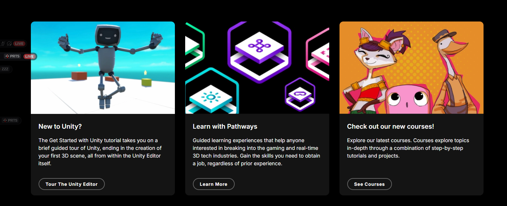

# Entry 1
##### 11/9/25

## Content

I have decided on the tool **Unity** where I'm going to make a roguelike game *(a video game genre named after the 1980 game Rogue, characterized by procedurally generated levels, permanent death, and often turn-based or grid-based movement)*  with it.

## Sources

Good luck to me. Unity has many built- in lessons for beginners like me to learn where you can find those lesson in [https://learn.unity.com/](https://learn.unity.com/) and I also can watch videos on youtube to learn.

## Engineering Design Process

In this entry I'm at the part where I'm trying out different tools and choosing the one we like, and afterwards I learn about the basics of Unity. where you can find my progress in [learning-log.md](../tool/learning-log.md), and the next part of my plan is after getting used to all the control of unity I'm going to follow one of those lessons and build up on my knowledge.

## Skills

In this entry I'm approving my **How to learn** skill where I have to learn something new with the help of the lesson they provided me. and I need to find out the most useful lesson for me since there's many different lessons and some may not be the best fit for me.

[Next](entry02.md)

[Home](../README.md)

