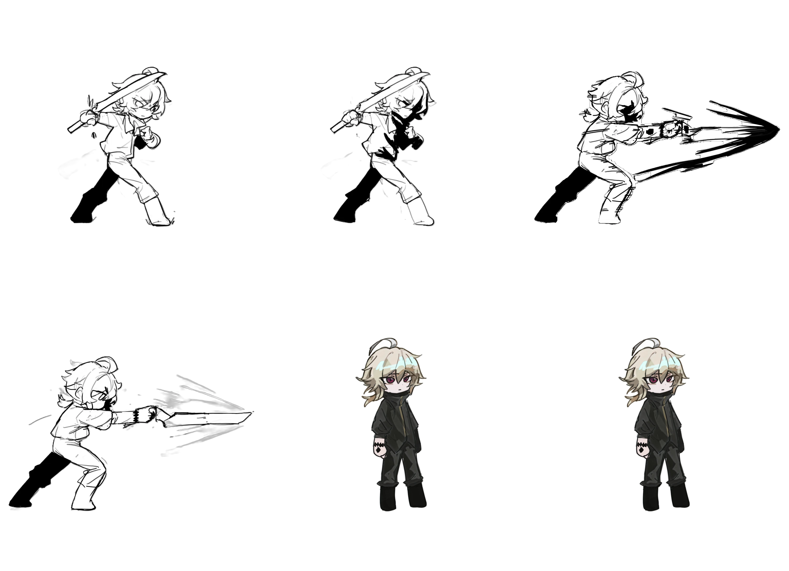

# Entry 4
##### 3/16/26

### Content
In this entry I has finish mostly of my learning and now I'm beginning to start working on my project

## Engineering Design Process
So far I have started working on my project and I choose to work on the sprite part first and after I create the basic sprite characters and I will add collision to it plus the movement of it. And here's one of the sprite sheet I created 

## Skill

In this entry I need to use the lessons I learn and put them into use. Along with me building this game, I am also relearning and practicing my skills. And I'm practicing my Time management skill, because recently I had a lot of stuff I need to complete for my other classes so I need to think up a way for me to work on the project

[Previous](entry03.md) | [Next](entry05.md)

[Home](../README.md)

