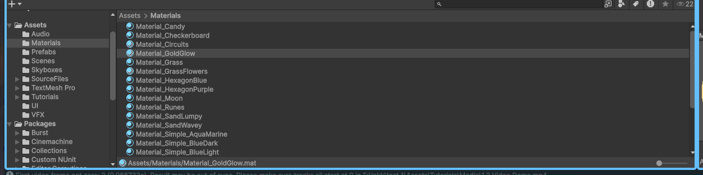
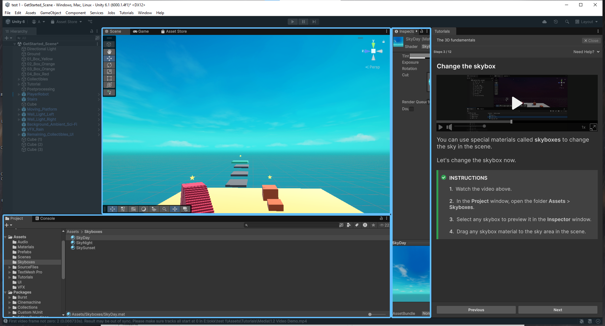
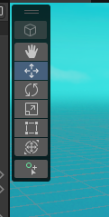
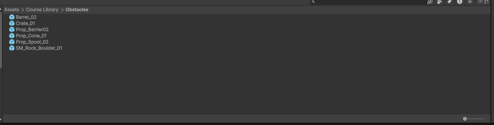
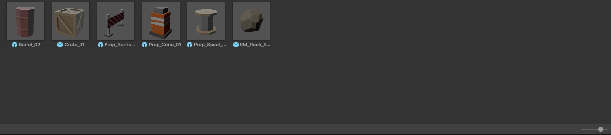
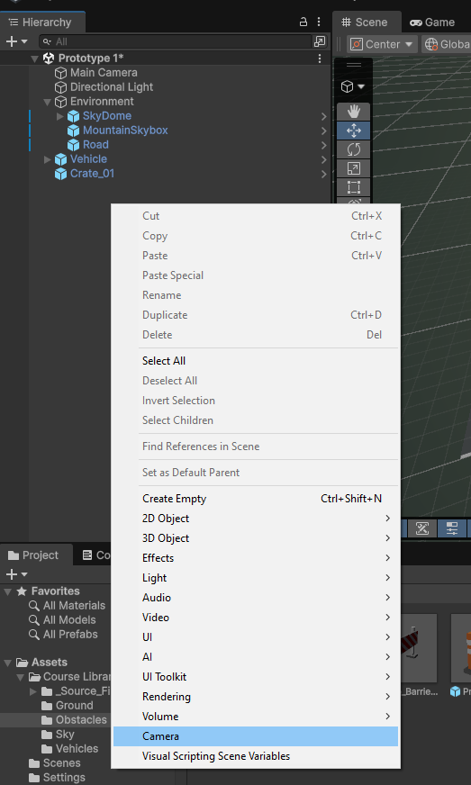
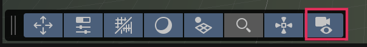
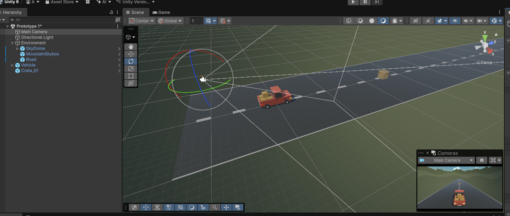
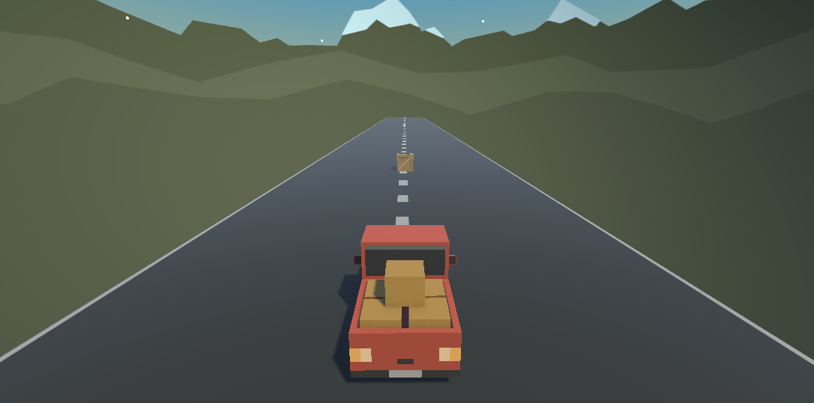

# Tool Learning Log

## Tool: **Unity**

## Project: **Rogue Like Game**

---

### 11/2/25:

## Unity Basic Controls

### 1. Scene Navigation

To move around the Scene view:

Right Mouse Button (Hold) + W/A/S/D → Fly around the scene.

Middle Mouse Button (Hold) → Pan view.

Scroll Wheel → Zoom in/out.

Q → Hand tool (pan)

W → Move tool

E → Rotate tool

R → Scale tool

T → Rect tool (for 2D/UI objects)

### 2. Object Selection

Left Click → Select object in the Scene or Hierarchy.

Shift + Click → Select multiple objects.

Ctrl/Cmd + D → Duplicate selected object.

Delete → Remove object.

### 3. Transform Basics

Every GameObject has a Transform component:

Position → Where the object is in the scene (x, y, z).

Rotation → How the object is rotated.

Scale → Size of the object.

You can change these in the Inspector or by using the Move/Rotate/Scale tools in the Scene.

### 4. Game View vs Scene View

Scene View → Where you build and arrange your game.

Game View → Shows what the player will see.

Switch between tabs at the top of the editor.

### 5. Play Mode

Play Button → Test your game in the editor.

Pause/Step Buttons → Debug or step through gameplay.

Changes made in Play Mode are not saved after stopping, unless copied to edit mode.

### 6. Hierarchy and Inspector

Hierarchy → Shows all objects in the scene.

Inspector → Shows details and components of the selected object.

Project Window → Where all your assets (models, scripts, textures) are stored.

### 11/16/25:

### Materials

you can change your material in the project file and fine where's all your material is located and drag it to the thing you wan to put the material on.

as for the sky you do the same but this time you drag the specfict skyboxes file to the sky 

1. Hand Tool (Pan View)

Lets you pan the Scene View without selecting or moving objects.

**Shortcut: Q**

2. Move Tool 

4-arrow cross

Move objects along X, Y, Z axes.

**Shortcut: W**

3. Rotate Tool

Curved rotation arrows

Rotate objects around X, Y, Z axes.

**Shortcut: E**

4. Scale Tool

Square scaling icon

Scale objects uniformly or per-axis.

**Shortcut: R**

5. Rect Tool

Rectangle with corner handles

Function: Move/Resize 2D objects & UI elements.

**Shortcut: T**

6. Transform Tool (Move + Rotate + Scale Combined)

Circles + arrows combined

A unified gizmo that allows moving, 
rotating, and scaling without switching tools.

**Shortcut: Y**

7. Create Placement Tool

Green circle with +

Function: Place new GameObjects (like prefabs) into the scene with click-to-place behavior.

(You activate it by selecting a prefab in the Hierarchy or dragging one)

<!-- 
* Links you used today (websites, videos, etc)
* Things you tried, progress you made, etc
* Challenges, a-ha moments, etc
* Questions you still have
* What you're going to try next
-->

### 12/8/25:

## Create with code

you can use the slider on the bottom right to zoom in and out of the item inside of a folder

added a secenes  by dragging it from the folder to the viewer

**F** Key is used when you can't find a object, first you click on the object you want to find in the hierarchy and press **F** and it will take your view to that object.

you can hold down the **Alt** and drag you mouse you can rotate around your camera with out moving 

right click hierarchy and you can add a camera that show the player's view

anything change in playmode will **not be save**
this is the what I have right now 

next step I'm going to continual with the lesson and try to make the car move
