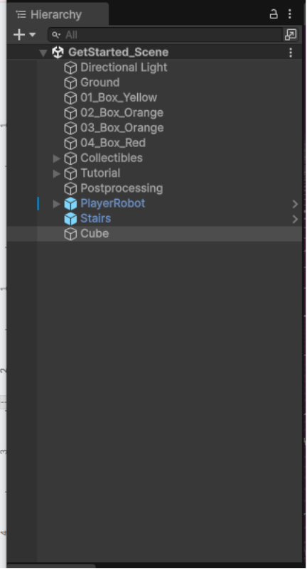
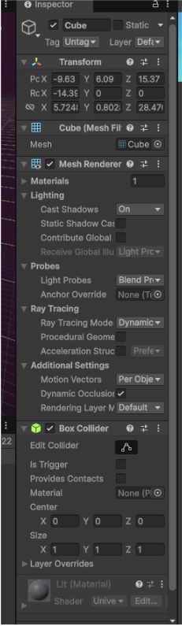
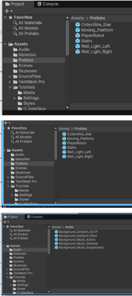

# Tool Learning Log

## Tool: **Unity**

## Project: **Rogue Like Game**

---

### 11/2/25:

## Unity Basic Controls

### 1. Scene Navigation

To move around the Scene view:

Right Mouse Button (Hold) + W/A/S/D → Fly around the scene.

Middle Mouse Button (Hold) → Pan view.

Scroll Wheel → Zoom in/out.

Q → Hand tool (pan)

W → Move tool

E → Rotate tool

R → Scale tool

T → Rect tool (for 2D/UI objects)

### 2. Object Selection

Left Click → Select object in the Scene or Hierarchy.

Shift + Click → Select multiple objects.

Ctrl/Cmd + D → Duplicate selected object.

Delete → Remove object.

### 3. Transform Basics

Every GameObject has a Transform component:

Position → Where the object is in the scene (x, y, z).

Rotation → How the object is rotated.

Scale → Size of the object.

You can change these in the Inspector or by using the Move/Rotate/Scale tools in the Scene.

### 4. Game View vs Scene View

Scene View → Where you build and arrange your game.

Game View → Shows what the player will see.

Switch between tabs at the top of the editor.

### 5. Play Mode

Play Button → Test your game in the editor.

Pause/Step Buttons → Debug or step through gameplay.

Changes made in Play Mode are not saved after stopping, unless copied to edit mode.

### 6. Hierarchy and Inspector

Hierarchy → Shows all objects in the scene.

Inspector → Shows details and components of the selected object.

Project Window → Where all your assets (models, scripts, textures) are stored.

<!-- 
* Links you used today (websites, videos, etc)
* Things you tried, progress you made, etc
* Challenges, a-ha moments, etc
* Questions you still have
* What you're going to try next
-->
